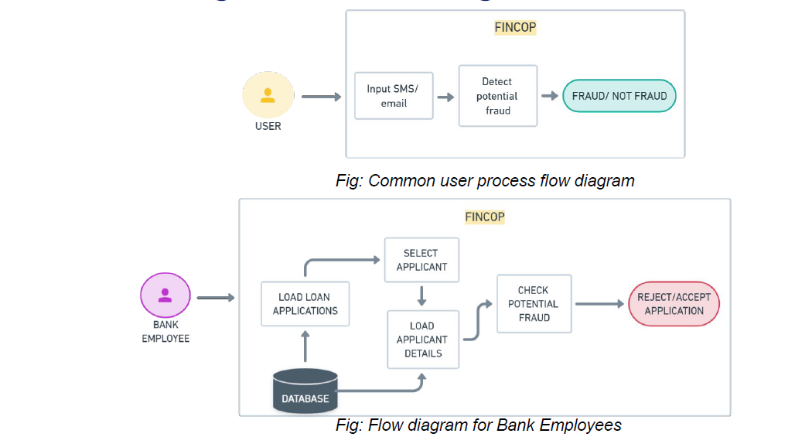

# Pitch-to-SBI-Hackathon

## Submission Instruction:
  1. Fork this repository
  2. Create a folder with your Team Name
  3. Upload all the code and necessary files in the created folder
  4. Upload a **README.md** file in your folder with the below mentioned informations.
  5. Generate a Pull Request with your Team Name. (Example: submission-XYZ_team)

## README.md must consist of the following information:

#### Team Name - FINCOP
#### Problem Statement - Real-Time High Scale Financial Fraud Risk Management
#### Team Leader Email - hindeshnit19@gmail.com

## A Brief of the Prototype:
  
  
## Tech Stack: 
   Following technologies were used to Build the prototype:
     1. Langchain\
     2. OpenAI API\
     3. Gradio\
     4. Pytesseract
   
## Step-by-Step Code Execution Instructions:

  Step 1: Clone the repository using the following command:\
        ```
        git clone https://github.com/hindesh-akash/Pitch-to-SBI-Hackathon.git
        ```
        
  Step 2: Install the requirements:\
        ```
        pip install -r requirements.txt
        ```
        
  Step 3: **IMPORTANT**\
        -> Setup your OpenAI key in the **openai.api_key** variable in "loan_fraud.py" and "upi_fraud_check.py"
        
  Step 4: Open a new terminal\
        To check for UPI fraud, run the following code:\
        ```
        python upi_fraud_check.py
        ```
    Then in the terminal click on the link generated for local host. Example- Running on local URL:  http://127.0.0.1:7861\
    To check for Loan Portfolio fraud, run the following code:\
        ```
        python loan_fraud.py
        ```
    Then in the terminal click on the link generated for local host. Example- Running on local URL:  http://127.0.0.1:7861\
    
  **Explore the app!**
  
## What I Learned:
   While developing the prototype I learned that if we do not pay attention to our transactions regarding whom we are paying and by what means, we can easily fall prey to financial fraud. I learned how LLMs can be used to leverage fraud detection and how an OCR model can reduce the human task of detecting whether a loan applicant is a defaulter. Similarily I learned the usage of robust machine learning models to detect credit defaults.
